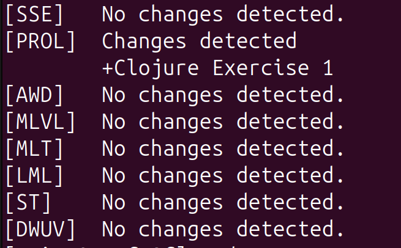

# LearnWeb Automation
An automation for checking updates of LearnWeb courses at the University of Hildesheim. The script logs into LearnWeb, scrapes activity names from course pages, stores snapshots, and prints differences between the last two snapshots for each course.

## Requirements
- **Python packages**: `selenium`, `python-dotenv`.
- **System dependencies**: A recent Chrome/Chromium browser and a matching `chromedriver` available on your `PATH` (or installed to a location that `webdriver.Chrome()` can find).
  - download it using `pip install webdriver-manager`

### Requirements Installation from `pyproject.toml`
- Create and activate a virtual environment:

```bash
python -m venv .venv
source .venv/bin/activate
```
- Install the project and its dependencies from `pyproject.toml` using `pip`:

```bash
python -m pip install --upgrade pip setuptools wheel
pip install .
```

### Configuration
- Create a `.env` file in the project root with these entries:

```
LOGIN=your_learnweb_username
PASSWORD=your_learnweb_password
```
- Create or update `course.json` in the project root. It must contain an object keyed by semester (the same key set in the script's `SEMESTER` variable). The semester object should include a `LOGIN_URL` entry (the LearnWeb login page for that semester) and one or more course short-names mapped to their course URLs. Example:

```json
{
    "winter_2025_2026": {
        "LOGIN_URL": "https://www.uni-hildesheim.de/learnweb2025/login/index.php",
        "Course1": "https://www.uni-hildesheim.de/learnweb2025/course/view.php?id=45",
        "Course2": "https://www.uni-hildesheim.de/learnweb2025/course/view.php?id=47",
        "Course3": "https://www.uni-hildesheim.de/learnweb2025/course/view.php?id=46",
    }
}
```

- Important: 
  - set `LOGIN_URL` to the login page for the **current semester** and 
  - set the `SEMESTER` constant inside `learnweb_automation.py` to match the semester key used in `course.json`.

## Usage
- Ensure the `file` directory exists in the project root (the script writes snapshots there):

```bash
mkdir file
```
- Run the script:

```bash
python learnweb_automation.py
```

- What the script does:
  - Loads `.env` (expects `LOGIN` and `PASSWORD`).
  - Loads `course.json` for the configured semester and pops `LOGIN_URL` to perform login.
  - Visits each course URL, extracts activity names, and writes a timestamped `.txt` snapshot to `file`.
  - Compares the two most recent snapshots per course and prints any differences.

### Output example


## Notes & Troubleshooting
- If you get driver-related errors, ensure `chromedriver` matches your Chrome/Chromium version. You can download `chromedriver` from the official site and place it on your `PATH` or use a manager such as `webdriver-manager` (not required by the script).
- If the script fails when writing files, ensure `file` exists and is writable.
- If login fails, verify `.env` values and that `LOGIN_URL` is correct for the semester.