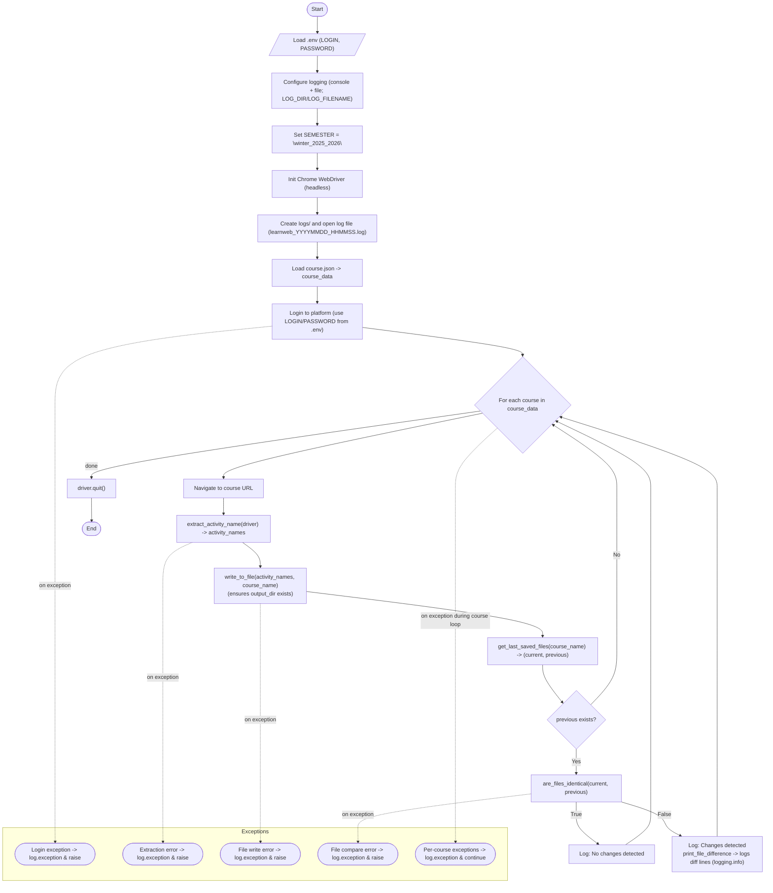

```mermaid
flowchart TD
  Start([Start])
  LoadEnv[/"Load .env (LOGIN, PASSWORD)"/]
  ConfigureLogging["Configure logging (console + file; LOG_DIR/LOG_FILENAME)"]
  InitSemester["Set SEMESTER = \"winter_2025_2026\""]
  InitDriver["Init Chrome WebDriver (headless)"]
  LogFileCreated["Create logs/ and open log file (learnweb_YYYYMMDD_HHMMSS.log)"]
  LoadConfig["Load course.json -> course_data"]
  Login["Login to platform (use LOGIN/PASSWORD from .env)"]
  ForEachCourse{"For each course in course_data"}
  Navigate["Navigate to course URL"]
  Extract["extract_activity_name(driver) -> activity_names"]
  WriteFile["write_to_file(activity_names, course_name)\n(ensures output_dir exists)"]
  GetLast["get_last_saved_files(course_name) -> (current, previous)"]
  PrevMissing{"previous exists?"}
  Compare["are_files_identical(current, previous)"]
  NoChange["Log: No changes detected"]
  Changes["Log: Changes detected\nprint_file_difference -> logs diff lines (logging.info)"]
  QuitDriver["driver.quit()"]
  End([End])

  Start --> LoadEnv --> ConfigureLogging --> InitSemester --> InitDriver --> LogFileCreated --> LoadConfig --> Login
  Login --> ForEachCourse
  ForEachCourse --> Navigate --> Extract --> WriteFile --> GetLast --> PrevMissing
  PrevMissing -- No --> ForEachCourse
  PrevMissing -- Yes --> Compare
  Compare -- True --> NoChange --> ForEachCourse
  Compare -- False --> Changes --> ForEachCourse
  ForEachCourse -->|done| QuitDriver --> End

  %% Error handling (exceptions) annotations
  subgraph Errors [Exceptions]
    LoginErr(["Login exception -> log.exception & raise"])
    ExtractErr(["Extraction error -> log.exception & raise"])
    WriteErr(["File write error -> log.exception & raise"])
    CompareErr(["File compare error -> log.exception & raise"])
    PerCourseErr(["Per-course exceptions -> log.exception & continue"])
  end

  Login -.->|on exception| LoginErr
  Extract -.->|on exception| ExtractErr
  WriteFile -.->|on exception| WriteErr
  Compare -.->|on exception| CompareErr
  ForEachCourse -.->|on exception during course loop| PerCourseErr
```